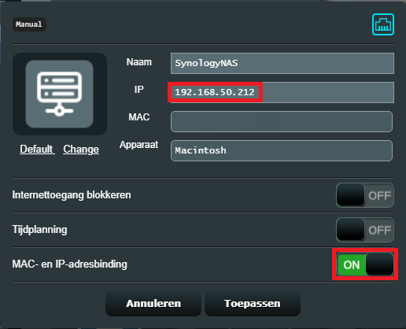
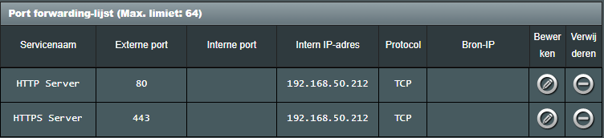
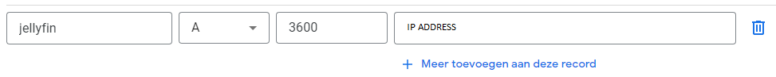
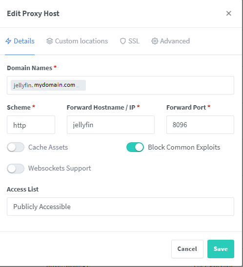
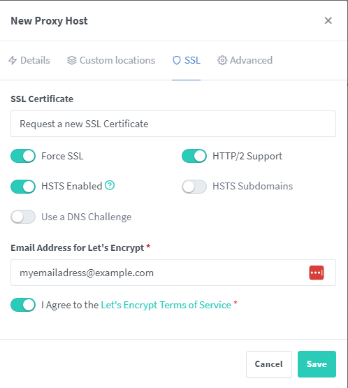

# Synology media server docker compose stack

Docker compose stack with services to find and host media on a NAS.

## Description

This docker compose stack combines a number of services to allow users to request media content, search for the content using either usenet or torrents and serve the media using Jellyfin. 

## Getting Started

### Dependencies

* Network Attached Storage (NAS) device
    * ~ 4 GB of [RAM](https://www.compuram.biz/memory/nas/)
    * Tested on a [Synology SD220+](https://www.synology.com/nl-nl/products/DS220+)
* [Docker Compose](https://docs.docker.com/compose/)
* [Domain name](https://tld-list.com/)
* Content Providers
    * Usenet
        * [Usenet Provider](https://www.reddit.com/r/usenet/wiki/providers/)
        * [Usenet Indexer](https://www.reddit.com/r/usenet/wiki/indexers/)
    * Torrents
        * [VPN](https://haugene.github.io/docker-transmission-openvpn/supported-providers/)
        * Torrent indexer (optional, free alternatives available)

### Installing

Follow these steps to get the docker compose stack up and running.

#### Setup port forwarding & Static IP

Go into the admin panel of your router and assign a static IP address to the device that you are going to use to host the docker compose stack.

Now go into the advanced configuration and setup port forwarding for HTTP (port 80) and HTTPS (port 443) traffic.

#### Install docker compose

Install docker-compose on your machine. This is different per platform, so please use Google to find out how to do it in your case.

#### Set environment variables

Make a copy of [.env.dist](.env.dist) and store it as .env. Replace all placeholder values for values applicable to your installation.

#### Create folder structure

Create the folder structure by running the [install.sh](install.sh) script. This will create all necesary folders for you.

#### Starting the Docker compose stack

Use `docker-compose up -d` to start the docker-compose stack. Make sure all ports are not in use by other services and make alterations to the [docker-compose.yml](docker-compose.yml) if necessary. The script [switch_ports.sh](/tasks/switch_ports.sh) might be of help here to move some default Synology webservices to different ports.

#### Domain & Reverse proxy configuration

Go to your domain registrar and create A records for the services in [docker-compose.yml](docker-compose.yml) that you wish to expose to the internet. Create A DNS records which will provision subdomains for your services (ex: jellyfin.mydomain.com) You can retrieve your own IP address by visiting [this website](https://www.ipchicken.com/). Propogation of these records can take some time.

If the docker compose stack has started successfully, NGINX Proxy Manager should now be acccessible. For the sake of this tutorial, I'll refer to the static IP that I have set for my NAS, so make sure to replace this with your own. By browsing to 192.168.50.212:81 I can start configuring this. Log in using the [default credentials](https://nginxproxymanager.com/setup/#default-administrator-user). Change the credentials and start adding proxy hosts for all services you wish to expose to the internet. For the Forward Hostname / IP, you can either refer to the name of the service in the  [docker-compose.yml](docker-compose.yml) or the internal IP of the NAS. Check the block common exploits option and request an SSL certificate in the SSL tab.

Click the save button and the application should now be accessible via https://jellyfin.mydomain.com

#### Configuring services

Now go to every service listed in the [docker-compose.yml](docker-compose.yml) and configure them. I will not cover this as part of this README to keep it somewhat short. Authors of the tools used in this docker compose stack have sufficient documentation available on how to connect the services. Be sure to setup authentication before exposing a service to the public internet.

### Starting/Stopping the docker stack

The docker stack can be started using: `docker-compose up -d`
The docker stack can be shut down using: `docker-compose down`

## Help

### View logs

Logs can be very informative to explain why something is not working. You can view all logs by performing this command: `docker-compose logs`

### The stack worked before but stopped working recently

It is possible that there were some changes in one of the docker containers used in this stack. Watchtower will automatically pull new versions which might contain new bugs or breaking changes. If such a thin occurs, you can pin a version in the [docker-compose.yml](docker-compose.yml) by specifying the docker image as for example: `jc21/nginx-proxy-manager:2.9.20`.

### Jellyfin very slow while scanning libraries

Jellyfin was very slow in my first setup while not maxing out either CPU nor RAM. I fixed this by moving all configuration files and databases to a fast USB stick since it looked like disk I/O was the problem.

## Authors

Contributors names and contact info

* [Jasper](https://github.com/jasper51297)

## Acknowledgments

* [Docker Media Server by Anand](https://www.smarthomebeginner.com/docker-media-server-2022/#Building_Docker_Media_Server): I've used this tutorial to get started myself.
* [/r/usenet](https://reddit.com/r/usenet): Information regarding Usenet providers and indexers